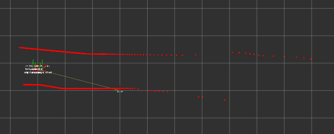
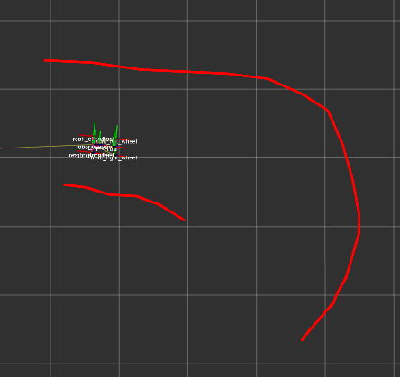

# Midline-tracing controller

A reactive controller for the Roboracer simulated RC car. Each control tick, it
traces the local track midline from a 2D lidar scan, then fits a bicycle-model
trajectory to that midline to extract a steering command.

## Why this approach

Two main alternatives in the F1TENTH world are pure-reactive (follow-the-gap,
disparity-extender) and full SLAM + planner. The first is simple but emits a
heading directly from the scan with no intermediate representation, which makes
it hard to layer richer behaviour on (lookahead, velocity profiling, recovery).
The second is heavy. Tracing a local midline gives us a real reference path
without building a global map — extensible, but still ~100 lines of code.

## Inputs / outputs

**Input per tick:**
- 2D lidar scan in vehicle frame (ranges + angles)

Note: we deliberately do not use vehicle pose. Simulator-provided pose is
off-limits for this controller, and rolling our own pose estimator (encoder
fusion, scan matching, etc.) is out of scope. Everything operates in the
current vehicle frame, recomputed from scratch each tick.

**Output:**
- Steering angle (rad)
- Throttle (m/s or normalized, see §5)

**Constants (tuneable):**
- `step` — midline sampling distance, default `0.1 m`
- `track_width` — known track width, e.g. `1.5 m`
- `cast_cap` — max lateral ray length, default `1.5 * track_width`
- `max_midline_length` — stop tracing past this, default `5 m`
- `iepf_threshold` — split-and-merge perpendicular deviation, default `0.05 m`
- `min_segment_points` — minimum returns per segment, default `3`
- `tangent_ema_alpha` — tangent smoothing, default `0.3`

## 1. Preprocessing: wall reconstruction via split-and-merge

Raw lidar returns are sparse and get sparser at distance. Operating on
individual returns makes the lateral ray-cast brittle — small angular gaps
between beams become false "no wall" results.



The example above shows the failure mode: returns thin out toward the right
of the scene and there are visible shadows even close in. A lateral ray
shooting between two beam returns would falsely report "no wall."

The fix is to reconstruct the actual wall geometry from the scan and ray-cast
against that, rather than against individual points. We use **split-and-merge
(IEPF)**, the standard polyline approximation for lidar scans:

```
def iepf(points):  # points in scan order
    if len(points) < 2:
        return []
    line = line_through(points[0], points[-1])
    idx, dev = max_perpendicular_deviation(points, line)
    if dev < iepf_threshold:
        return [Segment(points[0], points[-1])]
    return iepf(points[:idx+1]) + iepf(points[idx:])
```

Apply it independently to each contiguous run of returns (split first wherever
there's a missing beam or a large range jump that obviously indicates an
occlusion edge — `|r_i − r_{i+1}| > 1.0 m` is a fine pre-filter).

The output is a small set of line segments (typically 5–20 across a scan)
that approximate the visible walls. Subsequent ray-casts in §2 are
ray-vs-segment intersections.

**Why this beats the alternatives:**

- **Range-invariant.** The threshold is "how far can a return deviate from a
  straight wall fit," in metres. A wall at 10 m and a wall at 1 m both produce
  small deviations regardless of beam spacing. No need to scale with range.
- **Sub-pixel accurate.** Walls aren't thickened, so the midline isn't biased.
- **Identifies corners explicitly.** The recursion splits at points of maximum
  deviation, which are exactly the geometric corners. Useful later if we want
  curvature-based velocity planning.
- **Cheap.** ~30 lines of code, recursion depth ≤ log of scan length.

Discard segments with fewer than `min_segment_points` returns — these are
typically noise or single-return artefacts.

We deliberately do *not* inflate segments by car half-width here. Perception
representation stays geometrically accurate; safety margin (if needed) is
applied at the controller level by biasing the racing line, not by lying
about where the walls are.

## 2. Midline tracing

The algorithm walks forward from the car, alternating between *sampling* a
point and *casting* sideways to find the midpoint between walls.

```
M[0]       = car position (or just ahead of bumper)
tangent[0] = car heading
for i in 1..N:
    sample = M[i-1] + step * tangent[i-1]
    cast_dir = perpendicular(tangent[i-1])
    left_hit  = raycast(sample,  cast_dir, cap=cast_cap)
    right_hit = raycast(sample, -cast_dir, cap=cast_cap)
    M[i] = midpoint_from_hits(sample, cast_dir, left_hit, right_hit)
    tangent[i] = ema(tangent[i-1], normalize(M[i] - M[i-1]), alpha)
    if termination_condition(): break
```

### 2.1 The tangent update — why it matters

Each cast is perpendicular to where the midline is *currently going*, not to
the car's heading. As soon as one wall is closer than the other, the next
midpoint shifts sideways, the tangent rotates, the next cast rotates with it,
and the sampling spirals around the curve.

Without this, casts always shoot perpendicular to the car heading; on any
curve sharper than a gentle bend, the rays eventually shoot past one wall and
into open space, producing midpoints that fly off the track.

The tangent always lags by one step — `tangent[i]` is computed *after* `M[i]`
is found, then used at iteration `i+1`. With small `step` and EMA smoothing,
the lag is negligible.

### 2.2 Tangent smoothing

A two-point tangent estimate is noisy on real lidar. Use an EMA:

```
tangent[i] = normalize(alpha * raw_tangent + (1 - alpha) * tangent[i-1])
```

Without smoothing, jitter on individual midpoints turns into wandering casts.
`alpha = 0.3` is a reasonable starting point.

### 2.3 Initialisation

The first tangent has to come from somewhere. Default to car heading. If the
car is mid-corner with significant slip, this biases `M[0]` slightly; in
practice the self-correcting tangent update absorbs this within 2–3 steps.

## 3. Midpoint computation and the one-sided fallback

`midpoint_from_hits` handles three cases:

**Both sides hit (typical case):**
```
M[i] = (left_hit + right_hit) / 2
```

**One side hits, other misses (hairpin / wall ends):**
Place a virtual wall at `track_width` from the visible side, perpendicular to
the current tangent. The midpoint sits `track_width / 2` from the visible wall
on the inside-of-track side.

```
# example: left hit, right missed
M[i] = left_hit - (track_width / 2) * cast_dir
```

This is what makes hairpins work. When the inner wall ends mid-corner, the
midline glues itself to the outer wall at a fixed offset, traces around the
curve, and reconnects to two-sided behaviour when the inner wall re-appears.
The visible wall plus a known track width fully determines a valid drivable
path.



Worked example using the scene above: the outer wall is visible the whole
way around the hairpin; the inner wall is a short stub that ends well
before the apex. First few samples produce normal two-sided midpoints. Once
the inner stub ends, the right cast misses and the fallback places a virtual
wall at `track_width` from the outer hit. The midline then traces around the
outer wall at a `track_width / 2` offset until the inner wall re-appears on
exit. The bicycle-model fit on this midline produces a "turn hard right"
steering command.

**Both miss:** terminate the trace (see §4).

## 4. Termination

Stop extending when any of:

- Both casts miss for `K` consecutive steps (default `K=2`) — degenerate scene,
  no wall info
- Total midline length exceeds `max_midline_length` (default `5 m`) — enough
  for the bicycle fit, more is wasted compute
- `N` exceeds a hard cap (default `100`) — safety against infinite loops

A short midline (1–2 m) is fine. Re-running the whole trace every control tick
is cheap; we're not trying to plan a global path.

## 5. Control synthesis

### 5.1 Steering: bicycle-model fit

For a kinematic bicycle with wheelbase `L`, a steering angle `δ` produces a
circular arc of radius `R = L / tan(δ)`. From the car's current pose, fit `δ`
that minimises sum-squared distance from the bicycle arc to the traced
midpoints `M[1..N]`:

```
δ* = argmin_δ Σ ||arc(δ, s_i) - M[i]||²
```

where `s_i` is the arc-length to the i-th midpoint. This is a 1D optimisation
— either solve analytically (small-angle linearisation) or do a coarse grid
search + refinement over `δ ∈ [-δ_max, +δ_max]`.

Weight near-term midpoints more heavily: errors at 0.5 m matter more than at
4 m. Exponential or linear decay both work.

### 5.2 Throttle

Start with constant throttle for bring-up. Then map throttle to steering
magnitude:

```
v = v_max - (v_max - v_min) * |δ| / δ_max
```

Optionally factor in midline curvature (max curvature anywhere along the
traced midline) for proper lookahead-based slowdown.

## 6. Failure modes and mitigations

| Failure | Trigger | Mitigation |
|---|---|---|
| Both walls invisible | Open arena, spinout, lidar drop-out | Hold last command for `T` ms; if persists, fall back to follow-the-gap on raw scan |
| Track width changes mid-track | Chicanes, varying widths | Estimate `track_width` from running average of two-sided midpoint distances |
| Sharp corner inside lidar range but midline cap reached | `max_midline_length` shorter than corner | Increase cap, or accept — next tick will see further |
| Aliasing on first sample | Slip angle large, car heading mis-aligned with track | One-step follow-the-gap to seed initial tangent instead of using car heading |
| Mid-trace tangent flip | Discontinuous wall (e.g. doorway, pit entry) | EMA smoothing absorbs small flips; large ones should trigger trace termination |

## 7. Implementation notes

- Algorithm is stateless across ticks. Re-trace from scratch each control
  cycle. This is robust, avoids drift, and — critically — means we never need
  vehicle pose. The cost is dominated by IEPF and raycasts (both cheap).
- All work happens in the current vehicle frame.
- Raycast is ray-vs-segment intersection against the IEPF polylines. For each
  cast, iterate over segments, compute parametric intersection, keep the
  smallest non-negative `t` within `cast_cap`. With ~20 segments and 2 casts
  per midline step, this is negligible.
- Tunables are intentionally exposed — expect to retune `step`,
  `tangent_ema_alpha`, `cast_cap`, and `iepf_threshold` empirically once
  running.

## 8. Open questions

- Best objective for the bicycle fit (sum-squared distance vs. final-point
  alignment vs. heading match at lookahead distance)
- Whether to smooth the midline before fitting (probably yes — Savitzky-Golay
  over the midpoint sequence)
